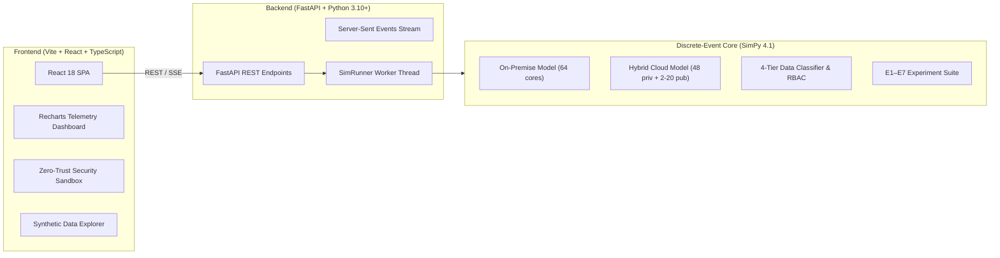

# CC-CIPAT — Secure Hybrid Cloud Banking Migration Platform (v2.0)

> **Final-Year Computer Engineering CIPAT Project**  
> **Architecture**: Decoupled Full-Stack Platform (FastAPI Python Backend + Vite React TypeScript Frontend)

---

## 🏛️ Project Architecture Overview



---

## 🚀 Quick Start Guide

### 1. Backend Setup (FastAPI & SimPy)
```bash
cd backend
pip install -r requirements.txt
python -m uvicorn app.main:app --host 0.0.0.0 --port 8000 --reload
```
* API Documentation: [http://localhost:8000/docs](http://localhost:8000/docs)
* Health Endpoint: [http://localhost:8000/api/health](http://localhost:8000/api/health)

### 2. Frontend Setup (Vite + React + TypeScript)
```bash
cd frontend
npm install
npm run dev
```
* Web Dashboard: [http://localhost:5173](http://localhost:5173)

---

## 📊 Completed Stages & Experiments

- ✅ **Stage 1**: Project Structure & JSON Configurations
- ✅ **Stage 2**: 8 Synthetic Banking Datasets (170K rows) + 6 Workload Traces (W1–W6)
- ✅ **Stage 3**: On-Premise Baseline Discrete Simulation (64 Cores)
- ✅ **Stage 4**: Hybrid Cloud Simulation (48 Private + Fixed Public Cores)
- ✅ **Stage 5**: Load Balancing & Elastic Autoscaling (**E4: 39% Latency Reduction, 64% Queue Dampening**)
- ✅ **Stage 6**: 4-Tier Zero-Trust Security Classification (**E7: 99.49% Accuracy, Zero Data Leaks**)
- 🔲 **Stage 7**: Failure & Recovery Simulation (W5/W6 Chaos Injection)
- 🔲 **Stage 8–10**: Full Evaluation Suite, Final Academic Report & Presentation

---

## 📁 Repository Structure

```
d:/CC-Cipat/
├── backend/
│   ├── app/
│   │   ├── main.py              # FastAPI application entrypoint
│   │   ├── routes/              # simulation, experiments, datasets, security
│   │   └── services/            # sim_runner service
│   ├── config/                  # JSON simulation & security configs
│   ├── data/                    # Synthetic CSVs & workload traces (W1-W6)
│   ├── src/                     # Core SimPy simulation engine & security modules
│   ├── results/                 # Processed experiments (E1-E4, E7) & 16 figures
│   ├── tests/                   # 6 PyTest verification modules
│   └── requirements.txt         # Python dependencies
├── frontend/
│   ├── src/
│   │   ├── components/          # Navbar, Overview, Simulation, Experiments, Security, Data
│   │   ├── api/                 # Axios client & TypeScript types
│   │   ├── App.tsx              # Root application component
│   │   └── main.tsx             # React mount
│   ├── package.json
│   ├── tailwind.config.js
│   └── vite.config.ts
├── docs/                        # Academic architecture & experiment documentation
└── README.md
```
