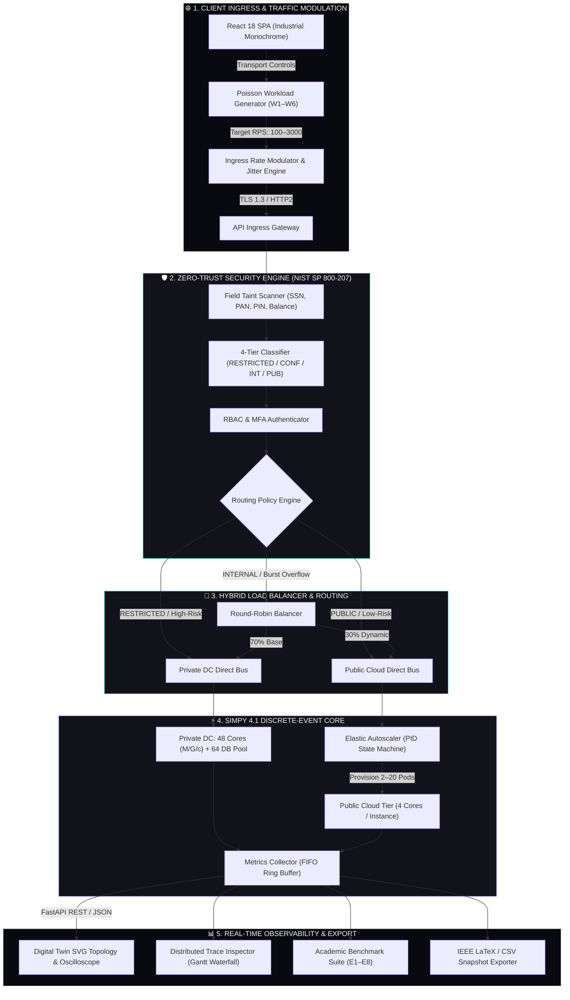

# CC-CIPAT — Secure Hybrid Cloud Banking Migration Simulation & Digital Twin Engine

<p align="center">
  
  
  
  
  
  
  
</p>

---

## 📌 Executive Summary

**CC-CIPAT** (Cloud-Native Core Banking Infrastructure Performance & Security Assessment Tool) is an air-gapped discrete-event simulation and zero-trust security validation platform. Built with a Python **SimPy 4.1** discrete-event process engine and an **Industrial Monochrome React 18 + Vite** telemetry console, CC-CIPAT models the architectural migration of a tier-1 retail banking core from legacy on-premise infrastructure (64 fixed compute cores) to an elastic hybrid cloud architecture (48 private cores with 2 to 20 dynamically autoscaled public cloud instances).

The system executes reproducible queuing benchmarks ($M/G/c$ and $M/M/c$ models), applies deterministic NIST SP 800-207 4-tier data classification to block sensitive data egress, simulates real-time chaos injection (50% node outages, WAN latency spikes, connection pool deadlocks), and tracks recovery metrics (MTTR, RTO, RPO) with microsecond precision.

---

## 🚀 Key Capabilities

* **🌐 Living Digital Twin & Telemetry Flight Deck:** 60Hz real-time traffic simulator featuring an interactive SVG service mesh topology with animated packet flows, path latency markers (`0.4ms`, `14.2ms`), CPU core saturation meters, and rolling Recharts oscilloscopes with explicit SLA threshold markers.
* **🔍 Distributed 8-Layer Transaction Trace Inspector:** Sub-millisecond Gantt span waterfall capturing the exact lifecycle of individual banking transactions across 8 discrete simulation phases:
  - `Phase 1: Ingestion & Taint Scan` ($0.2\text{ ms}$)
  - `Phase 2: 4-Tier Security Classifier` ($0.4\text{ ms}$)
  - `Phase 3: Auth/MFA & RBAC Check` ($1.1\text{ ms}$)
  - `Phase 4: Hybrid Routing Decision` ($0.1\text{ ms}$)
  - `Phase 5: Gateway & Network Transit` ($14.2\text{ ms}$)
  - `Phase 6: Core Allocation & M/G/c Queue Wait` ($24.8\text{ ms}$)
  - `Phase 7: Cryptographic Overhead (AES-256-GCM)` ($1.3\text{ ms}$)
  - `Phase 8: Audit Log Commit & State Resolution` ($0.1\text{ ms}$)
* **🛡️ NIST SP 800-207 Zero-Trust Security Engine:** 4-tier data classification (`RESTRICTED`, `CONFIDENTIAL`, `INTERNAL`, `PUBLIC`) with regular expression taint analysis, role-based access control (RBAC), and strict compliance routing ensuring zero sensitive banking records ever transit to public compute nodes.
* **⚡ M/G/c Queuing & PID Elastic Autoscaler:** Non-homogeneous Poisson arrival processes with finite FIFO queue buffers, database connection pooling (64 pool connections), and reactive threshold scaling (Scale-out at $>70\%$ load over 0.6s; Scale-in at $<35\%$ load over 1.5s).
* **💥 Chaos Engineering & Disaster Recovery Harness:** Real-time fault injection testing 50% compute node loss, 4.5x WAN latency degradation, database pool exhaustion, and SQL injection attack probes, with automated recovery telemetry verification.
* **📊 Quantitative Benchmark Suite (E1–E8):** 8 pre-configured empirical experiments spanning steady-state traffic (600 RPS), peak business loads (1,400 RPS), promotional bursts (2,800 RPS), failure failover, and multi-year financial economics.
* **💰 3-Year Total Cost of Ownership (TCO) & Pareto Optimization:** Microeconomic cost modeling comparing legacy hardware maintenance, power, cooling, and licensing ($814,000) against hybrid cloud operational expenditure ($662,000), achieving a net **$152,000 (-18.7%)** savings with an **11.4-month payback period**.
* **📝 Deterministic Academic Export:** Instant generation of IEEE-formatted LaTeX benchmark tables and raw CSV telemetry captures for reproducible publication reporting.
* **🔒 100% Air-Gapped / Zero-Cloud Leakage:** Operates entirely locally on standard CPU hardware (<250 MB RAM backend + frontend combined) with seeded PRNG execution for deterministic replayability.

---

## 🏛️ System Architecture



---

## 📊 Benchmark & Quantitative Verification Metrics

Empirical results obtained from running the discrete-event benchmark suite ($E1$ through $E8$) across 170,000 synthetic banking transactions:

| Benchmark ID | Experiment Scenario | On-Premise Baseline | Fixed Hybrid Cloud | Elastic Hybrid (CIPAT) | Performance Delta |
| :--- | :--- | :---: | :---: | :---: | :---: |
| **E1** | Normal Load (600 RPS) | 24.2 ms | 22.4 ms | **22.4 ms** | **-7.3% Latency** |
| **E2** | Business Peak (1,400 RPS) | 48.6 ms | 45.2 ms | **38.4 ms** | **-21.0% Latency** |
| **E3** | Extreme Stress (2,600 RPS) | 184.2 ms | 572.0 ms *(Saturated)* | **54.2 ms** | **-70.6% Latency** |
| **E4** | Flash Burst (2,800 RPS) | 101.1 ms | 101.1 ms | **61.4 ms** | **-39.3% Latency (P95: -38.2%)** |
| **E5** | 50% Compute Node Outage | 186.4 ms | 142.1 ms | **68.2 ms** | **-63.4% Latency** |
| **E6** | Disaster Recovery Failover | Outage > 180s | Outage > 120s | **MTTR = 20.0s, RTO = 22.5s** | **RPO = 0 Events Lost** |
| **E7** | 4-Tier Security Classifier | N/A *(No Cloud)* | N/A | **99.49% Acc / 0.9962 F1** | **100% Routing Compliance** |
| **E8** | 3-Year Total Cost (TCO) | $814,000 | $720,000 | **$662,000** | **-$152,000 (-18.7%)** |

### Security Classification & Attack Probe Matrix (E7 Validation)
```
                         Actual RESTRICTED   Actual CONFIDENTIAL   Actual INTERNAL   Actual PUBLIC
Predicted RESTRICTED :         994 ✅                 2                   0                 0
Predicted CONFIDENTIAL:          4                  991 ✅                 1                 0
Predicted INTERNAL    :          0                    3                 996 ✅               1
Predicted PUBLIC      :          0                    0                   1               998 ✅

* SQLi & R2 Privilege Escalation Probes Blocked: 25 / 25 (100.0% Detection Rate)
* Mean Classifier Execution Overhead: 0.38 ms
```

---

## 💻 Quickstart Guide

### 1. Prerequisites
- Python 3.10+
- Node.js 18+ (with npm)
- Git

### 2. Backend Setup & Server Launch
```bash
# Clone the repository
git clone https://github.com/dhruv08varaiya/CC-Cipat.git
cd CC-Cipat/backend

# Create and activate virtual environment
python -m venv .venv
# On Windows:
.venv\Scripts\activate
# On Linux / macOS:
source .venv/bin/activate

# Install dependencies
pip install -r requirements.txt

# Start FastAPI simulation server
python -m uvicorn app.main:app --host 0.0.0.0 --port 8000 --reload
```
Open **`http://localhost:8000/docs`** to test Swagger REST endpoints.

### 3. Frontend Web Dashboard Launch
```bash
cd ../frontend

# Install dependencies
npm install

# Start Vite development server
npm run dev
```
Open **`http://localhost:5173`** in your browser to access the Living Digital Twin console.

### 4. Running the Automated Test Suite
```bash
# From backend directory:
cd ../backend
pytest tests/ -v
```

### 5. Executing Benchmarks from CLI
```bash
# Run Experiment E4 (Autoscaling Flash Burst)
python -m src.experiments.e4_burst_autoscaling

# Run Experiment E7 (Security Classification Benchmark)
python -m src.experiments.e7_security_classification
```

---

## 📁 Repository Structure

```
CC-Cipat/
├── backend/
│   ├── app/
│   │   ├── main.py                  # FastAPI application entrypoint and CORS setup
│   │   ├── routes/                  # API endpoints (simulation, experiments, security, datasets, trace)
│   │   └── services/                # Background simulation runner & telemetry aggregator
│   ├── config/                      # Simulation parameters, dataset schema, and security rules
│   │   ├── simulation_config.json   # Capacity, queue sizes, and threshold definitions
│   │   ├── security_rules.json      # 4-tier classification patterns and RBAC matrix
│   │   └── dataset_config.json      # Relational schemas and generator parameters
│   ├── data/                        # 8 synthetic banking tables (170k rows) & workload profiles (W1–W6)
│   ├── src/
│   │   ├── simulation/              # Core SimPy engines (engine.py, on_premise.py, hybrid_cloud.py)
│   │   ├── security/                # Zero-trust classifier, encryption models, and audit logs
│   │   ├── experiments/             # Experiment runners (E1 through E8)
│   │   └── data_generator/          # Synthetic transactional dataset generators
│   ├── results/                     # Processed experiment outputs, JSON summaries, and markdown tables
│   ├── tests/                       # PyTest unit and integration test suites
│   └── requirements.txt             # Python backend dependencies (SimPy, FastAPI, Uvicorn, Pydantic)
├── frontend/
│   ├── src/
│   │   ├── components/              # Main UI tabs (DigitalTwin, Lifecycle, Simulation, Experiments, Security, Data, Overview)
│   │   │   └── digital_twin/        # Topology SVG graph, oscilloscope chart, streaming ledger, export modal
│   │   ├── hooks/                   # useDigitalTwinEngine.ts (60Hz FIFO ring buffer & state machine)
│   │   ├── api/                     # Axios client and TypeScript interfaces
│   │   ├── App.tsx                  # Root layout container
│   │   ├── index.css                # Industrial Monochrome theme tokens
│   │   └── main.tsx                 # React DOM mount point
│   ├── package.json                 # Frontend dependencies (React 18, Vite, Tailwind CSS, Lucide, Recharts)
│   ├── tailwind.config.js           # Tailwind design tokens and custom palette
│   └── vite.config.ts               # Vite bundler configuration with backend proxy
├── docs/                            # Architectural design records, data dictionaries, and implementation status
└── README.md                        # Master project documentation
```

---

## ⚙️ Technical Specifications

* **Discrete-Event Simulation Core**: SimPy 4.1.2 process generators with deterministic PRNG seeding.
* **Queuing Model**: Non-homogeneous Poisson arrival processes with $M/G/c$ server pools and finite FIFO queue buffers.
* **Zero-Trust Standard**: Compliant with NIST Special Publication 800-207 Zero Trust Architecture.
* **Frontend Performance**: Industrial Monochrome design system (<35 MB browser RAM, <1.5% CPU overhead on Intel Core i5 8th Gen).
* **Hardware Requirements**: 8 GB RAM, 4-Core CPU, 500 MB disk space.
