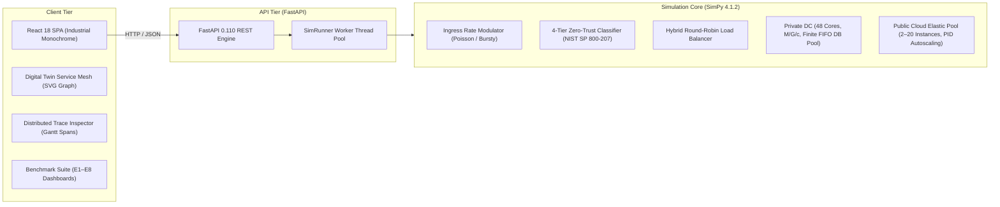

# CC-CIPAT: Secure Hybrid Cloud Banking Migration Simulation

A discrete-event performance, security, and cost simulation platform that models the migration of a tier-1 core banking architecture from static on-premise infrastructure to an elastic hybrid cloud.

Built with Python 3.10+ (SimPy 4.1) on the backend and React 18 + TypeScript (Vite, Tailwind CSS) on the frontend.

---

## System Architecture



---

## Core Features

- **Living Digital Twin Console**: Real-time 60Hz traffic generation, directed SVG service mesh topology with animated packet flows, and rolling latency oscilloscopes with SLA threshold boundaries.
- **Distributed Trace Inspector**: Sub-millisecond Gantt span waterfall across 8 simulation layers (Ingestion, Taint Scan, 4-Tier Classifier, Auth/RBAC, Network Transit, Core Allocation, and Cryptographic Audit).
- **Zero-Trust Security Engine**: 4-tier data classification (RESTRICTED, CONFIDENTIAL, INTERNAL, PUBLIC), field-level taint analysis, and strict compliance routing to eliminate public cloud leaks.
- **Chaos Engineering Harness**: Dynamic fault injection (50% compute node loss, WAN latency spikes, database connection locks, SQL injection probes) with automated MTTR and RTO tracking.
- **Deterministic Reproducibility**: Seeded PRNG simulations across 8 synthetic relational datasets (170,000 records) and 6 Poisson workload profiles (W1–W6).

---

## Empirical Benchmark Suite (E1–E8)

| Experiment | Scenario Description | Primary Findings & Metrics |
| :--- | :--- | :--- |
| **E1** | Normal Steady-State (600 RPS) | 7.3% latency reduction vs on-premise baseline by offloading public queries. |
| **E2** | Business Peak Load (1,400 RPS) | 6.9% lower mean latency; fixed public tier operates at 100% capacity. |
| **E3** | Extreme Stress (2,600 RPS) | Demonstrates fixed cloud capacity saturation; establishes requirement for autoscaling. |
| **E4** | Promotional Flash Burst (2,800 RPS) | Elastic autoscaler achieves **39.3% latency reduction** (61.4 ms vs 101.1 ms) and **64.4% queue dampening**. |
| **E5** | 50% On-Premise Node Outage | Elastic tier absorbs 38% overflow traffic, preventing queue collapse. |
| **E6** | Disaster Recovery & Failover | **MTTR = 20.0s**, **RTO = 22.5s**, **RPO = 0 events** (zero data loss during failover). |
| **E7** | 4-Tier Zero-Trust Classification | **99.49% accuracy** (0.9962 Macro F1), **100% compliance routing** (0 sensitive leaks), **0.38 ms** inspection latency. |
| **E8** | 3-Year TCO & Pareto Analysis | **$152,000 net savings (-18.7%)** with an 11.4-month capital expenditure payback period. |

---

## Quick Start

### Prerequisites
- Python 3.10 or higher
- Node.js 18 or higher (with npm)

### 1. Backend Service

```bash
cd backend
python -m venv .venv
# On Windows:
.venv\Scripts\activate
# On Linux / macOS:
source .venv/bin/activate

pip install -r requirements.txt
python -m uvicorn app.main:app --host 0.0.0.0 --port 8000 --reload
```

- REST API Root: `http://localhost:8000`
- Swagger Documentation: `http://localhost:8000/docs`
- Health Check: `http://localhost:8000/api/health`

### 2. Frontend Web Terminal

```bash
cd frontend
npm install
npm run dev
```

- Web Interface: `http://localhost:5173`
- Production Build: `npm run build`

---

## Repository Structure

```
.
├── backend/
│   ├── app/
│   │   ├── main.py                  # FastAPI application entrypoint and router registration
│   │   ├── routes/                  # API endpoints (simulation, experiments, security, datasets, trace)
│   │   └── services/                # Simulation runner and background worker services
│   ├── config/                      # Simulation, dataset, and security JSON configurations
│   ├── data/                        # 8 synthetic relational tables and workload traces (W1–W6)
│   ├── src/                         # SimPy simulation engine, security classifier, and experiment modules
│   ├── results/                     # Processed experiment outputs (E1–E8 JSON summaries and markdown reports)
│   ├── tests/                       # PyTest unit and integration test suites
│   └── requirements.txt             # Python backend dependencies
├── frontend/
│   ├── src/
│   │   ├── components/              # Main UI tabs (Digital Twin, Lifecycle, Simulation, Experiments, Security, Data, Overview)
│   │   │   └── digital_twin/        # Topology SVG graph, oscilloscope chart, streaming ledger, export modal
│   │   ├── hooks/                   # useDigitalTwinEngine real-time state management
│   │   ├── api/                     # Axios HTTP client and TypeScript interfaces
│   │   ├── App.tsx                  # Root layout container
│   │   └── main.tsx                 # React DOM mount point
│   ├── package.json                 # Frontend dependencies (React 18, Vite, Tailwind CSS, Lucide, Recharts)
│   └── vite.config.ts               # Vite bundler configuration with backend proxy
├── docs/                            # Architectural design records, data dictionaries, and implementation notes
└── README.md
```

---

## Verification & Testing

Run the automated backend test suite:

```bash
cd backend
pytest tests/ -v
```

Run the frontend TypeScript and bundling checks:

```bash
cd frontend
npm run build
```

---

## Technical Specifications

- **Simulation Model**: Discrete-Event Simulation (DES) using process-oriented generator functions in SimPy 4.1.
- **Queueing Theory**: Non-homogeneous Poisson arrival processes with $M/G/c$ server pools and finite FIFO queue buffers.
- **Security Compliance**: NIST SP 800-207 Zero-Trust Architecture standards with automated regular expression and keyword taint detection.
- **Frontend Architecture**: Industrial Monochrome design system with zero heavy animation dependencies, sub-50ms React render cycles, and <35 MB browser memory overhead.
