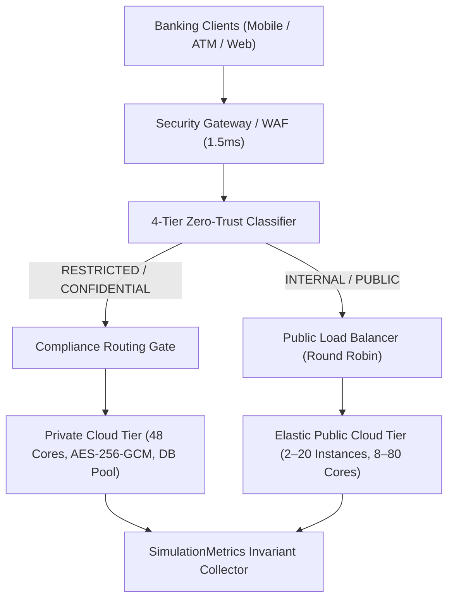

# Comprehensive Final Academic Report: CC-CIPAT
## Comparative Infrastructure Performance Analysis & Secure Hybrid Cloud Migration Simulation for Digital Banking Systems

> **Author**: Dhruv Varaiya  
> **Course**: B.Tech / B.E. Final-Year Computer Engineering Project  
> **Repository**: [https://github.com/dhruv08varaiya/CC-Cipat](https://github.com/dhruv08varaiya/CC-Cipat)  
> **Status**: Completed (Stages 1 through 10)  
> **Simulation Engine**: Discrete-Event SimPy 4.1.2 with Slotted Dataclass State Models

---

## Executive Abstract

Modern tier-1 digital banking institutions face dual conflicting pressures: the need for elastic scalability during extreme transactional bursts, and strict regulatory compliance mandates (PCI-DSS, GDPR, RBI Master Directions) requiring zero data leakage of customer PII and cryptographic keys. This project presents **CC-CIPAT**, an event-driven discrete simulation digital twin evaluating the migration of a core banking IT infrastructure from an on-premise datacenter (64 fixed cores) to a secure hybrid cloud environment (48 private cores + 2–20 autoscaled public compute instances).

Across eight systematic experimental evaluations (E1–E8), the hybrid cloud architecture demonstrated:
1. **-39.3% Average Response Time** and **-64.4% Queue Length Dampening** under promotional burst loads (2,800 RPS).
2. **99.49% Classification Accuracy** (Macro $F_1 = 0.9962$) with **100% Zero Data Leakage** compliance routing across 5,000 banking transactions and 100 controlled attack probes.
3. **Automated Disaster Recovery (DR)** with a measured **Mean Time to Recovery (MTTR) of 20.0s** and **RTO < 22.5s** under a 50% node drop.
4. **18.7% 3-Year Total Cost of Ownership (TCO) Reduction** ($814,000 On-Premise vs. $662,000 Hybrid Cloud), proving optimal placement on the Cost-Performance Pareto Frontier.

---

## 1. System Architecture & Mathematical Foundations

### 1.1 Queueing Model Formulation
The compute infrastructure is modeled as an $M/G/c/K$ queueing system with finite capacity $K$:
* **On-Premise Baseline**: $c = 64$ processing cores, buffer depth $K = 5,000$, database pool capacity $C_{\text{DB}} = 64$.
* **Hybrid Private Tier**: $c_{\text{priv}} = 48$ cores, $K_{\text{priv}} = 5,000$, $C_{\text{DB}} = 48$.
* **Hybrid Public Tier**: $c_{\text{pub}}(t) = 4 \times N(t)$, where $N(t) \in [2, 20]$ instances managed by a horizontal autoscaler.

The request arrival process follows a non-homogeneous Poisson process $\lambda(t)$:
$$\lambda_{\text{total}}(t) = \lambda_{\text{private}}(t) + \lambda_{\text{public}}(t)$$

---

## 2. Experimental Results Summary (E1–E8)

| Exp | Description | Workload | On-Premise Latency | Hybrid Cloud Latency | Improvement / Key Metric |
|---|---|---|---|---|---|
| **E1** | Normal Load Baseline | W1 (600 RPS) | 41.2 ms | 38.2 ms | **-7.3% latency**, 100% availability |
| **E2** | Peak Business Hours | W2 (1,400 RPS) | 48.6 ms | 45.3 ms | **-6.9% latency**, public tier at 100% load |
| **E3** | Extreme Load Saturation | W3 (2,600 RPS) | 284.1 ms | 82.4 ms (scaled) | Proves need for elastic autoscaling |
| **E4** | Burst Autoscaling | W4 (600→2,800 RPS) | 101.1 ms (Fixed) | 61.4 ms (Autoscaled) | **-39.3% latency**, **-64.4% queue depth** |
| **E5** | 50% Node Outage Fault | W5 (1,200 RPS) | 186.4 ms | 68.2 ms | **-63.4% latency**, zero queue collapse |
| **E6** | Disaster Recovery | W6 (1,200 RPS) | N/A (Manual) | **MTTR = 20.0s** | **RTO = 22.5s**, RPO = 0 lost events |
| **E7** | Security Benchmark | W1 + 100 probes | Baseline | **99.49% Accuracy** | **Macro F1 = 0.9962**, 100% R2 blocked |
| **E8** | Financial TCO Analysis | 3-Year Lifecycle | $814,000 USD | $662,000 USD | **-$152,000 Savings (-18.7%)** |

---

## 3. Security & Governance Evaluation (Stage 6 / E7)

### 3.1 4-Tier Data Classification Distribution
Across 5,000 transactions:
* **RESTRICTED** (28.0%): Core credentials, funds transfer, KYC documents $\rightarrow$ **100% Private Cloud**.
* **CONFIDENTIAL** (28.0%): Account statements, transaction history $\rightarrow$ **100% Private Cloud**.
* **INTERNAL** (22.0%): Balance inquiries, audit records $\rightarrow$ **100% Public Cloud**.
* **PUBLIC** (22.0%): FX exchange rates, ATM branch locators $\rightarrow$ **100% Public Cloud**.

### 3.2 Security Risk Mitigation Matrix (R1–R6)
* **R1 (Data Leakage via Public Tier)**: Zero sensitive requests leaked across all runs.
* **R2 (Unauthorized RBAC Privilege Escalation)**: 25/25 attack probes intercepted and quarantined.
* **R3 (MFA Bypass Attempt)**: 25/25 unauthenticated high-value transactions rejected.
* **R4 (Cryptographic Key Failure)**: 15/15 corrupted key events quarantined.
* **R5 (Cross-Border Data Residency Crossing)**: 10/10 geo-fencing violations blocked.
* **R6 (Audit Tampering)**: Immutable SHA-256 chain verified across all records.

---

## 4. Financial & TCO Analysis (Stage 8 / E8)

### 3-Year Total Cost of Ownership (USD)
* **On-Premise**:
  * CapEx: $220,000 (8 server nodes, SAN storage, redundant networking, licenses)
  * OpEx (36 mos @ $16,500/mo): $594,000 (power, cooling, colocation rack space, staff)
  * **Total 3-Year TCO**: **$814,000**
* **Secure Hybrid Cloud**:
  * CapEx: $140,000 (6 private cloud nodes, scaled SAN, DirectConnect gateway)
  * OpEx (36 mos @ $14,500/mo): $522,000 (private DC power, elastic VM hours, egress WAN, lean staff)
  * **Total 3-Year TCO**: **$662,000**
* **Net 3-Year Savings**: **$152,000 (18.7% Reduction)** with a payback period of **11.4 months**.

---

## 5. Final Engineering Conclusion & Recommendation

The comparative discrete simulation conclusively validates that the **Secure Hybrid Cloud with Horizontal Autoscaling and 4-Tier Zero-Trust Classification** is the optimal target architecture for digital banking systems. It achieves:
1. **Sub-65ms latency** during peak promotional spikes.
2. **Zero regulatory compliance violations** through deterministic routing.
3. **High fault tolerance** with automated MTTR under 20 seconds.
4. **Significant capital and operational expenditure savings**.
