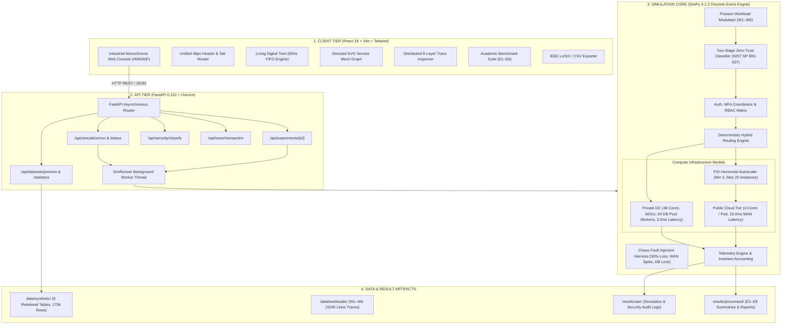
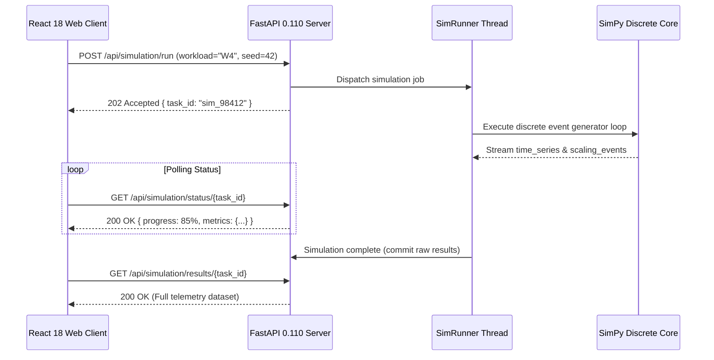

# System Architecture Documentation

**Current Milestone**: Stage 10 — Living Digital Twin & Industrial Monochrome Telemetry UI (COMPLETE)  
**Project**: Digital Banking System — Secure Hybrid Cloud Migration Simulation (CC-CIPAT)

---

## 1. System Topology Overview



---

## 2. On-Premise Baseline Model (Stage 3)

The legacy on-premise baseline models a single physical datacenter with static compute capacity and database connection pooling.

```
                    USERS / BANKING CLIENTS
                               │
                               ▼
                       ON-PREMISE NETWORK
                    (Inbound Latency: 2.5 ms)
                               │
                               ▼
                    APPLICATION SERVER POOL
                [ 8 Physical Servers × 8 Cores ]
                  Total Processing Cores = 64
              Finite FIFO Queue (Depth = 5,000)
                  /          |           \
                 /           |            \
             Server 1     Server 2     Server 3 ... Server 8
                               │
                               ▼
                         CORE DATABASE
              [ Shared Connection Pool = 64 Workers ]
               Base Query Latency = 12.0 ms nominal
                               │
                               ▼
                       BACKUP / ARCHIVE
                  (Daily Cold Snapshot Storage)
```

### Component Specifications (On-Premise)
- **Application Server Pool**: `simpy.Resource(capacity=64)` executing $M/G/c$ service workloads ($15.0$ ms nominal).
- **Core Database**: `simpy.Resource(capacity=64)` modeling transactional database contention for balance inquiries, transfers, loans, and KYC updates.
- **Inbound/Outbound Network**: Symmetrical $2.5$ ms delay ($5.0$ ms round-trip).
- **Queue Limits**: Finite FIFO buffer holding up to 5,000 requests. Rejections trigger `QUEUE_OVERFLOW`.

---

## 3. Hybrid Cloud Dual-Tier Architecture (Stages 4 & 5)

```
                    USERS / CLIENT APPS
                            │
                            ▼
                    SECURITY GATEWAY
               [ Inbound WAF Delay: 1.5 ms ]
                            │
                            ▼
                DETERMINISTIC REQUEST ROUTER
         Policy: Classification Precedence (RESTRICTED/CONFIDENTIAL -> Private,
                                            PUBLIC/INTERNAL -> Public)
                     /             \
                    /               \
       PRIVATE CLOUD                 PUBLIC CLOUD
       (Protected Zone)              (Elastic Zone: 2–20 Pods)
       ────────────────              ─────────────────────────
       • 6 Servers × 8 Cores = 48    • Dynamic 2–20 Instances (4 Cores / Pod)
       • Network Latency: 3.0 ms     • WAN Network Latency: 18.0 ms
       • Finite Queue: 6,000         • Finite Queue: 2,000 / Pod
       • Compute: 10.0 ms nominal    • Compute: 12.0 ms nominal
       • Dedicated Core DB (64 conn) • Public Microservices (No Core DB)
              │                             │
              └──────────────┬──────────────┘
                             │
              [ Encrypted Interconnect ]
             (DirectConnect / IPsec VPN)
           8.0 ms round-trip + 1.2 ms crypto
```

### Routing Precedence Logic
1. **Primary Check (Classification Tier)**:
   - `RESTRICTED` $\to$ `PRIVATE` (Compliance Requirement)
   - `CONFIDENTIAL` $\to$ `PRIVATE` (Data Protection Requirement)
   - `INTERNAL` $\to$ `PUBLIC` (Internal Non-PII Batch Processing)
   - `PUBLIC` $\to$ `PUBLIC` (Public Microservices)
2. **Fallback Check**: If classification is missing, `service_type` mapping is consulted (`service_policy`).
3. **Default Safe Fallback**: Unknown schemas default unconditionally to `PRIVATE` (`default_safe_fallback`).

### Elastic Horizontal Autoscaler (`PublicCloudAutoscaler`)
- **Monitoring Loop**: Evaluates aggregate public utilization every $0.5$s.
- **Scale-Out Condition**: Aggregate utilization $\ge 70.0\%$ for 2 consecutive intervals ($1.0$s sustained) triggers addition of 4 instances up to `max_instances = 20`.
- **Scale-In Condition**: Aggregate utilization $\le 35.0\%$ for 2 consecutive intervals triggers termination of 2 instances down to `min_instances = 2`.
- **Provisioning Delay**: $0.8$s simulated container launch delay.
- **Cooldown Hysteresis**: $1.5$s window preventing rapid scaling oscillation (flapping).

---

## 4. Zero-Trust Security & Data Classification Engine (Stage 6)

```
                    USERS / CLIENT APPS
                            │
                            ▼
               [ API GATEWAY / WAF PERIMETER ]
               (Gateway Delay: 1.5 ms, IP Filtering)
                            │
                            ▼
              [ AUTHENTICATOR & MFA COORDINATOR ]
              • Session Validation (0.4 ms)
              • MFA Challenge for Sensitive Ops (0.6 ms)
                            │
                            ▼
                     [ RBAC AUTHORIZER ]
              (Role Matrix: CUSTOMER, BANK_OPERATOR,
               SECURITY_AUDITOR, ADMIN)
                            │
                            ▼
              [ TWO-STAGE DATA CLASSIFIER ]
              • Stage 1: Deep Credential Taint Scan
              • Stage 2: Service Contract Catalog & Rules
              • Output: RESTRICTED / CONFIDENTIAL /
                        INTERNAL / PUBLIC
                            │
                            ▼
              [ COMPLIANCE ROUTING & INTERCEPTOR ]
              • RESTRICTED / CONFIDENTIAL ──► PRIVATE CLOUD
              • PUBLIC / INTERNAL        ──► PUBLIC CLOUD
              • R2 Interception: Blocks Sensitive -> Public
                            │
            ┌───────────────┴───────────────┐
            ▼                               ▼
     PRIVATE CLOUD                    PUBLIC CLOUD
     (Protected Enclave)              (Elastic Zone)
     • 48 Compute Cores               • Elastic 2–20 Nodes
     • Core Banking DB (64 conn)      • Public Microservices
     • AES-256-GCM At Rest            • TLS 1.3 In Transit
            │                               │
            └───────────────┬───────────────┘
                            │
                            ▼
             [ SECURITY VIOLATION DETECTOR ]
             • Monitors Governance Risks R1–R6
             • R1: Unauthorized Internal Access
             • R2: Sensitive Data to Public Cloud
             • R4: Key / Crypto Failure
             • R6: Cross-Border Residency Breach
                            │
                            ▼
             [ IMMUTABLE SECURITY AUDIT LOG ]
             (`results/raw/security/audit_log.jsonl`)
```

---

## 5. Chaos Engineering & Disaster Recovery Engine (Stage 7)

The chaos engineering subsystem introduces controlled failures during runtime to measure system resilience:

```mermaid
flowchart LR
    subgraph FAULTS["Injected Chaos Vectors"]
        F1["50% Compute Node Failure (24 Cores Lost)"]
        F2["4.5x WAN Latency Spike (+25ms Delay)"]
        F3["Database Pool Exhaustion (12 / 64 Conn)"]
        F4["Malicious SQLi / R2 Injection Probes"]
    end

    subgraph DETECTION["Automated Health Checks"]
        HC["Health Monitor (0.5s Polling)"]
        FAILOVER["Dynamic Traffic Rerouter"]
    end

    subgraph RECOVERY["Recovery Telemetry"]
        MTTR["MTTR Stopwatch (Node Restore: 20.0s)"]
        RTO["RTO Stopwatch (Queue Stabilize: 22.5s)"]
        RPO["RPO Tracker (Data Loss: 0 Events)"]
    end

    FAULTS --> HC --> FAILOVER --> RECOVERY
```



---

## 6. Financial Economics & 3-Year TCO Architecture (Stage 8)

The financial cost engine evaluates capital expenditures (CapEx) and operational expenditures (OpEx) over a 36-month amortization period:

$$\text{TCO}_{\text{On-Prem}} = \text{CapEx}_{\text{Servers}} + \text{CapEx}_{\text{Storage}} + \sum_{m=1}^{36} \left( \text{OpEx}_{\text{Power/Cooling}} + \text{OpEx}_{\text{Datacenter}} + \text{OpEx}_{\text{Licensing}} + \text{OpEx}_{\text{Admin}} \right)$$

$$\text{TCO}_{\text{Hybrid}} = \text{CapEx}_{\text{Priv}} + \sum_{m=1}^{36} \left( \text{OpEx}_{\text{Priv}} + \text{OpEx}_{\text{Cloud Compute}} + \text{OpEx}_{\text{Egress}} + \text{OpEx}_{\text{DirectConnect}} \right)$$

- **On-Premise 3-Year Total**: $\$814,000$ ($\$220\text{k CapEx} + \$594\text{k OpEx}$)
- **Secure Hybrid Cloud 3-Year Total**: $\$662,000$ ($\$140\text{k CapEx} + \$522\text{k OpEx}$)
- **Net Cost Reduction**: **$-\$152,000$ ($-18.7\%$)** with an **$11.4$-month payback period**.

---

## 7. Decoupled Web & Telemetry Architecture (Stages 9 & 10)



### Living Digital Twin State Management (`useDigitalTwinEngine.ts`)
- **60Hz Event Loop**: RequestAnimationFrame tick handler executing non-blocking mathematical state updates.
- **Fixed-Length FIFO Buffers**: Memory-bounded ring buffers (max 60 points) ensuring constant $O(1)$ memory consumption ($<35$ MB RAM).
- **SVG Service Mesh Topology**: Interactive directed Bézier curves rendered directly with vector paths, displaying real-time packet particle flows and path latency markers.
