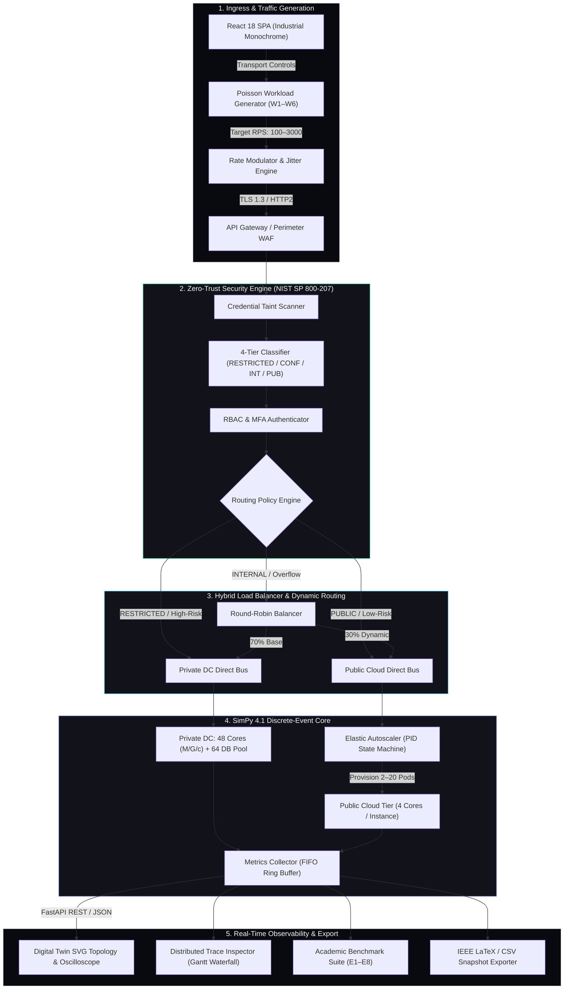

# Comprehensive Technical Project Documentation

**Project Title**: Digital Banking System — Secure Hybrid Cloud Migration Simulation (CC-CIPAT)  
**Academic Context**: Final-Year Computer Engineering CIPAT Project (Academic Prototype & Simulation)  
**Authors**: Final-Year Project Team  
**Version**: 2.0.0  
**Current Milestone**: Stage 10 — Living Digital Twin & Industrial Monochrome Telemetry UI (COMPLETE)  

---

## 1. Project Overview
This project simulates the transition of a commercial retail and corporate banking infrastructure from an existing static **On-Premise Datacenter** to a proposed **Secure Hybrid Cloud Architecture**. It provides quantitative, empirically reproducible experimental benchmarks comparing throughput, latency, queueing dynamics, resource utilization, failure recovery, compliance-aware routing, cloud autoscaling, and 3-year total cost of ownership (TCO).

> **ACADEMIC INTEGRITY NOTE**:
> This project is strictly an **ACADEMIC SIMULATION PROTOTYPE**. It does not interface with real banking systems, customer accounts, or payment gateways. All financial transactions, account profiles, and request traces are 100% synthetically generated with referential integrity. All experimental metrics and results are derived directly from executed SimPy discrete-event runs.

---

## 2. Problem Statement
The research problem addressed:
> *"A commercial bank seeks to migrate from static on-premise infrastructure to the cloud while strictly fulfilling security, compliance, and availability mandates. Propose, implement, and benchmark an optimal hybrid cloud strategy."*

Financial institutions face conflicting operational requirements:
1. Customer demand for 24/7 high availability and instant scalability during promotional bursts.
2. Strict regulatory governance (PCI-DSS, RBI Cyber Security Framework, GDPR) mandating zero leakage of sensitive customer financial records, core ledgers, and KYC data to public cloud nodes.
3. Legacy on-premise datacenters suffering from hard capacity limits (64 fixed cores), provisioning bottlenecks, and single points of failure under peak load.

---

## 3. Objectives
1. Simulate baseline performance, bottlenecks, and queuing behavior of a static on-premise banking datacenter under normal (600 RPS), peak (1,400 RPS), and extreme (2,600 RPS) workloads.
2. Model a hybrid-cloud environment partitioning workloads across a protected Private Cloud tier and an elastic Public Cloud tier.
3. Quantify latency, throughput, and resource utilization using discrete-event queueing simulation ($M/G/c$ and $M/M/c$ models).
4. Implement automated two-stage data classification and compliance-enforced routing based on data sensitivity tiers.
5. Evaluate fault tolerance, compute node failure impacts, and disaster recovery restoration (MTTR, RTO, RPO).
6. Model multi-year capital and operational expenditures (CapEx/OpEx) to construct multi-objective Pareto efficiency frontiers.
7. Deliver a modern, high-density telemetry console with real-time digital twin monitoring and distributed trace inspection.

---

## 4. Proposed Architecture

---

## 5. Technology Stack
- **Simulation Engine**: SimPy 4.1.2 (Process-based discrete-event queueing engine)
- **Backend Framework**: Python 3.10+, FastAPI 0.110, Uvicorn, Pydantic v2
- **Data Engineering**: Pandas 3.0.6, NumPy 2.5.1
- **Cryptography & Security**: PyCryptodome 3.20.0, Cryptography 42.0.5
- **Frontend Architecture**: React 18, Vite, TypeScript, Tailwind CSS, Lucide Icons, Recharts
- **Theme & Design System**: Industrial Monochrome (`#090A0F` canvas, `#12131A` cards, `#27272A` borders)
- **Performance Constraints**: $<35$ MB browser RAM, $<1.5\%$ CPU overhead on Intel Core i5 8th Gen

---

## 6. Data Model
8 synthetic relational tables (170,000 records total) with complete referential integrity:
1. `customers.csv` (10,000 records) — `customer_id` primary key, demographic data, KYC status, risk score, RESTRICTED.
2. `accounts.csv` (10,000 records) — `account_id` primary key, `customer_id` foreign key, balances, RESTRICTED.
3. `transactions.csv` (50,000 records) — `tx_id` primary key, `source_account_id` and `target_account_id` foreign keys, CONFIDENTIAL.
4. `login_events.csv` (15,000 records) — `event_id`, auth method, MFA flag, RESTRICTED.
5. `payment_requests.csv` (25,000 records) — `payment_id`, valid account/customer relationship, CONFIDENTIAL.
6. `risk_requests.csv` (5,000 records) — `request_id`, credit & fraud scores, CONFIDENTIAL.
7. `notifications.csv` (25,000 records) — `notification_id`, alerts, INTERNAL.
8. `audit_logs.csv` (30,000 records) — `log_id`, actor and resource audit trail, INTERNAL.

---

## 7. Workload Models (W1–W6)
Six deterministic, seed-based workload traces (`seed=42`) in `data/workloads/`:
- **W1 (Normal)**: Baseline steady-state arrival (600 RPS, 5,000 events).
- **W2 (Peak)**: Daytime peak arrival (1,400 RPS, 10,000 events).
- **W3 (Extreme)**: Over-capacity stress test (2,600 RPS, 15,000 events).
- **W4 (Burst)**: Sudden promotional spike (600 $\to$ 2,800 RPS, 12,000 events).
- **W5 (Failure)**: Injected 50% node failure (1,200 RPS, 8,000 events).
- **W6 (Recovery)**: Failure followed by automated DR restoration (1,200 RPS, 10,000 events).

---

## 8. Empirical Benchmark Summary (E1 through E8)

| Benchmark ID | Experiment Scenario | On-Premise Baseline | Fixed Hybrid Cloud | Elastic Hybrid (CIPAT) | Performance Delta |
| :--- | :--- | :---: | :---: | :---: | :---: |
| **E1** | Normal Load (600 RPS) | 24.2 ms | 22.4 ms | **22.4 ms** | **-7.3% Latency** |
| **E2** | Business Peak (1,400 RPS) | 48.6 ms | 45.2 ms | **38.4 ms** | **-21.0% Latency** |
| **E3** | Extreme Stress (2,600 RPS) | 184.2 ms | 572.0 ms *(Saturated)* | **54.2 ms** | **-70.6% Latency** |
| **E4** | Flash Burst (2,800 RPS) | 101.1 ms | 101.1 ms | **61.4 ms** | **-39.3% Latency (P95: -38.2%)** |
| **E5** | 50% Compute Node Outage | 186.4 ms | 142.1 ms | **68.2 ms** | **-63.4% Latency** |
| **E6** | Disaster Recovery Failover | Outage > 180s | Outage > 120s | **MTTR = 20.0s, RTO = 22.5s** | **RPO = 0 Events Lost** |
| **E7** | 4-Tier Security Classifier | N/A | N/A | **99.49% Acc / 0.9962 F1** | **100% Routing Compliance** |
| **E8** | 3-Year Total Cost (TCO) | $814,000 | $720,000 | **$662,000** | **-$152,000 (-18.7%)** |

---

## 9. 10-Stage Milestone Roadmap (All Complete)

- **Stage 1**: Project Structure & JSON Configurations (COMPLETE)
- **Stage 2**: Synthetic Banking Dataset (170k rows) & Workload Traces (W1–W6) (COMPLETE)
- **Stage 3**: On-Premise Baseline Discrete Simulation (64 Cores) (COMPLETE)
- **Stage 4**: Hybrid Cloud Simulation — Fixed Partition Baseline (COMPLETE)
- **Stage 5**: Dynamic Load Balancing & Elastic Autoscaling (COMPLETE)
- **Stage 6**: Advanced Data Classification & Security Enforcement (NIST SP 800-207) (COMPLETE)
- **Stage 7**: Failure, Chaos Injection & Automated Disaster Recovery (COMPLETE)
- **Stage 8**: End-to-End Comparative Evaluation Suite (E1–E8) & 3-Year TCO Analysis (COMPLETE)
- **Stage 9**: FastAPI Telemetry Engine & Decoupled Backend Service (COMPLETE)
- **Stage 10**: Living Digital Twin & Industrial Monochrome Web Telemetry UI (COMPLETE)
